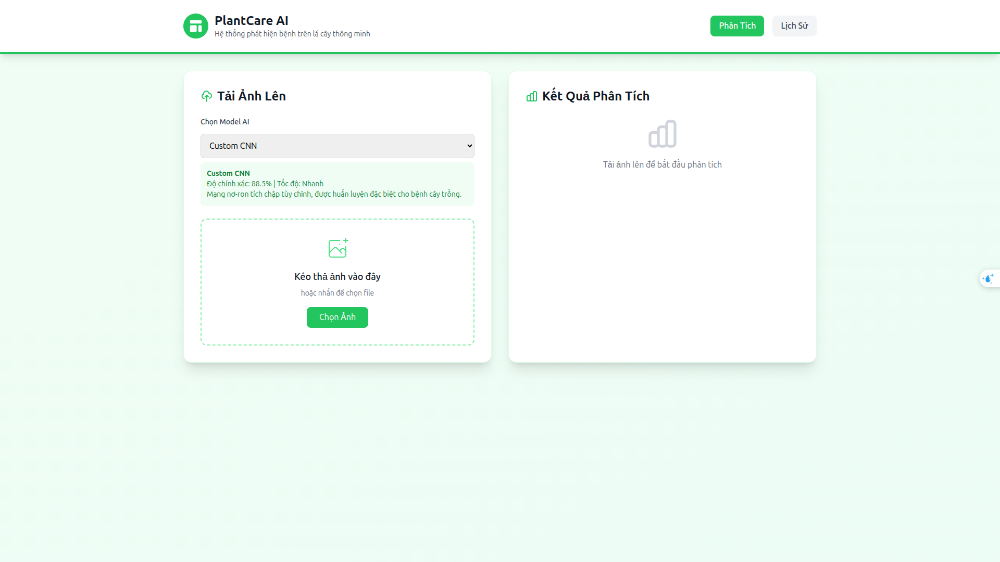

# Plant Disease Detection



## ✨ Tính năng chính
- **Huấn luyện**:
  - `POST /train/cnn`: CNN tự thiết kế
  - `POST /train/vgg19`: Transfer learning VGG19
- **Suy luận**:
  - `POST /infer`: nhận **upload ảnh** hoặc `image_path`, trả **top‑k** (kèm `label` nếu có dữ liệu nhãn).
  - `GET /labels`: trả danh sách nhãn (thứ tự index đúng với dataset).
- **Frontend**: `fe/index.html` sẵn JS “bridge” kết nối backend (CORS đã bật).

---

## 🧱 Cấu trúc thư mục
```
plantvillage_full_fe_server/
├── fe/
│   └── index.html            # Frontend (đã chèn script bridge)
├── server/
│   └── main.py               # FastAPI: /health, /train/*, /labels, /infer
├── pvcore/
│   ├── config.py             # seed, IMG_SIZE, auto_data_root, ...
│   ├── data.py               # tf.data pipeline, augmentations, class weights
│   ├── models.py             # CNN baseline, VGG19 TL + unfreeze helper
│   └── trainers.py           # train_cnn, train_vgg19, infer_image
├── shared/
│   ├── data/
│   └── images_readme/
└── requirements.txt
└── .gitignore
```

---

## 🚀 Khởi động nhanh (VS Code)
1. **Tạo venv & cài deps**
   ```bash
   python -m venv .venv
   # Windows PowerShell:
   .\.venv\Scripts\Activate.ps1
   # Linux/WSL:
   source .venv/bin/activate

   pip install -U pip -r requirements.txt
   pip install tensorflow           # hoặc: pip install 'tensorflow[and-cuda]'
   ```

2. **Khai báo dữ liệu**
   - Đặt biến môi trường `DATA_ROOT` tới thư mục PlantVillage (kiểu folder‑per‑class), hoặc tạo `./data` cùng cấu trúc.
   - Trên Kaggle, server có thể suy ra đường dẫn auto; local nên set `DATA_ROOT` cho chắc.

3. **Chạy backend**
   ```bash
   uvicorn server.main:app --host 0.0.0.0 --port 8000 --reload
   ```

4. **Mở frontend**
   - Mở `fe/index.html` bằng **Live Server** (VS Code) → FE gọi `http://127.0.0.1:8000`.

---

## 📡 API 

### `GET /health`
Trả `{ "ok": true }` nếu server sẵn sàng.

### `GET /labels`
Trả `{"labels": [...]}` theo thứ tự index dùng khi train.

### `POST /train/cnn`
- JSON fields: `data_root?`, `batch_size`, `epochs`, `lr`, `l2`
- Artifacts: `runs/cnn/cnn_best.h5`, `runs/cnn/result.json`

### `POST /train/vgg19`
- JSON fields: `data_root?`, `batch_size`, `phase1_epochs`, `phase2_epochs`, `fine_tune_from_block`, `lr1`, `lr2`, `dropout`, `weight_decay`
- Artifacts: `runs/vgg19/vgg19_best.h5`, `runs/vgg19/result.json`

### `POST /infer` (multipart/form-data)
- Fields: `model_path` (vd: `runs/vgg19/vgg19_best.h5`), `topk` (mặc định 5), `image_file` **hoặc** `image_path`, `data_root?`
- Trả: `{"predictions": [{"class_index": i, "prob": p, "label": "...?"}]}`

**cURL ví dụ**
```bash
curl -X POST http://127.0.0.1:8000/infer   -F model_path=runs/vgg19/vgg19_best.h5   -F topk=5   -F image_file=@/path/to/leaf.jpg
```

---


## ❗ Troubleshooting
- **Không thấy nhãn trong kết quả**: đảm bảo `GET /labels` trả về hoặc truyền `data_root` vào `/infer`.
- **Model path sai**: kiểm tra tồn tại `runs/*_best.h5` sau khi train.
- **CORS**: FE chạy ở Live Server (`127.0.0.1:5500`), backend bật CORS “*”; nếu bạn đổi cổng, cập nhật lại.
- **Windows + TF GPU**: cân nhắc WSL hoặc dùng bản CPU (`pip install tensorflow`).

---